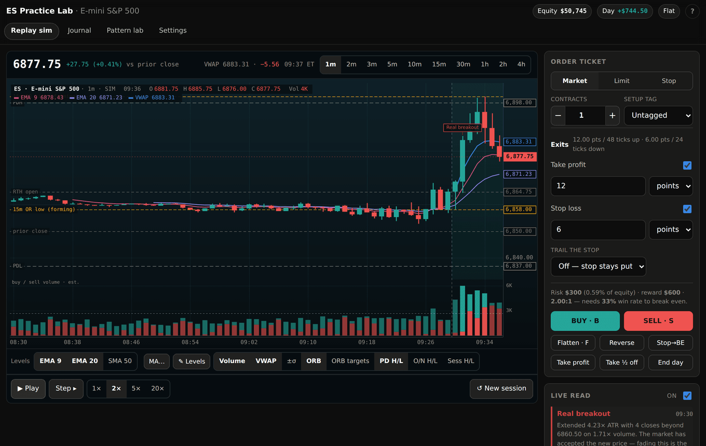
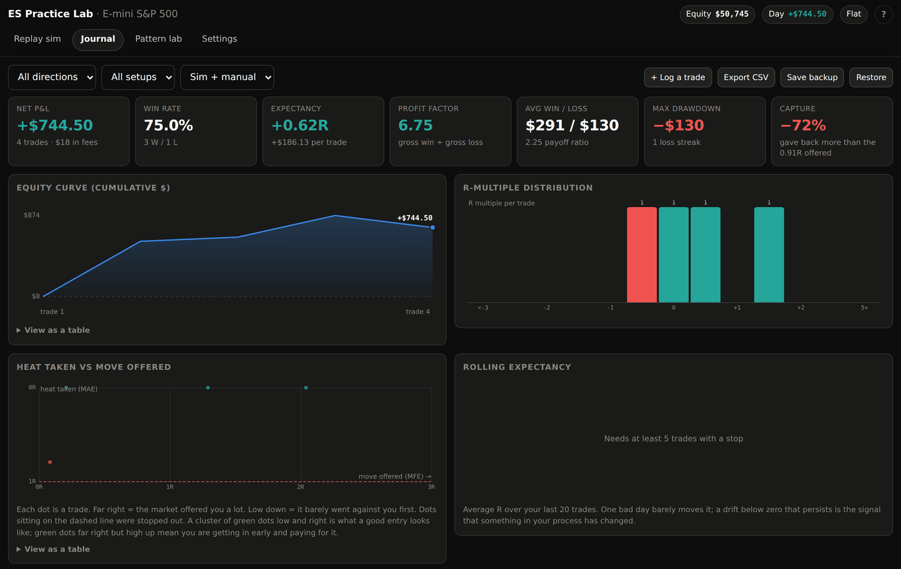
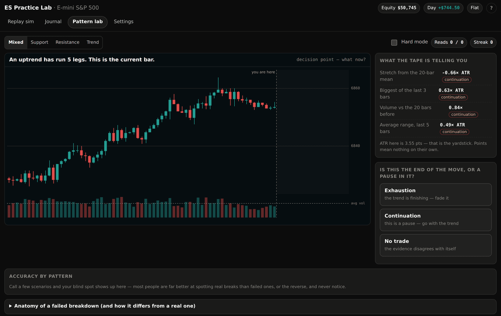

# ES Practice Lab

A flight simulator for E-mini S&P 500 futures. It drills the parts of trading
that are actually trainable — reading a break, placing risk, sizing a position,
sitting still — without money on the line.



Built with React, TypeScript and Vite. Everything runs in the browser; there is
no backend, and nothing ever leaves your machine.

**Source-available, not open source.** You can read the code, run it, and use it
to practise your own trading for free. Hosting it for other people or building a
commercial product on it requires a commercial license — see
[Licensing](#licensing).

> **Not trading advice, not a real account, not affiliated with any prop firm.**
> The price data is synthetic and contains no real market news. Futures trading
> can lose more than you deposit. Simulated results do not represent actual
> trading, and passing the practice evaluation mode does not mean you will pass
> — or are likely to pass — a real firm's evaluation. See
> [full disclosures](docs/LEGAL-DISCLAIMERS.md).

## What's in it

- **Replay sim** — a full session plays out bar by bar with a TradingView-style
  order ticket: market, limit and stop orders, scaling out, reversing, trailing
  stops, and a break-even stop. Every fill carries realistic commissions and
  slippage, so the P&L is honest. Set a daily loss cap and the app will refuse
  the trade that would blow through it.
- **Live pattern read** — a detector that calls failed breakdowns/breakouts,
  real breaks, sweeps and retests as they happen, computed only from bars that
  have already printed. No lookahead.
- **Pattern Lab** — drills that stop the chart at a decision point: a level just
  broke, was that real or a stop run? Call it, place your stop, then watch what
  actually happened. Hard mode hides the measurements so you have to read the
  chart itself.
- **Prop firm evaluation mode** — practise the rules that actually end funded
  accounts: static, end-of-day or intraday trailing drawdown, a profit target,
  a daily loss limit, a consistency rule, minimum trading days and a contract
  cap. A live card shows exactly where the drawdown line sits and how much
  cushion is left, so an intraday trail stops being a mystery. Rule maths is
  unit-tested — `npm test`.
- **Journal** — every trade logs itself, with win rate, expectancy in R, profit
  factor, capture ratio, MAE/MFE, five charts, and per-setup-tag breakdowns.
- **Bring your own bars** — import a CSV of real 1-minute bars from TradingView,
  NinjaTrader, Sierra or anything else, and replay real sessions instead of
  generated ones.
- Full keyboard shortcuts, a one-handed phone layout, colour-blind-safe candles,
  screen-reader announcements, and text-table alternatives for every chart.

| Journal | Pattern Lab |
| --- | --- |
|  |  |

## Getting started

Requires Node 20 or newer.

```bash
npm install
npm run dev
```

Then open the URL it prints (usually <http://localhost:5173>).

| Script | What it does |
| --- | --- |
| `npm run dev` | Start the dev server with hot reload |
| `npm run build` | Type-check, then build to `dist/` |
| `npm run preview` | Serve the production build locally |
| `npm run typecheck` | Type-check only |
| `npm test` | Run the evaluation rule-engine tests |

## Deploying

The app is fully static, so `npm run build` output in `dist/` can be dropped on
any static host — Netlify, Vercel, Cloudflare Pages, S3, or a plain web server.

For **GitHub Pages**, a workflow is already included at
`.github/workflows/deploy-pages.yml`. Enable it under
**Settings → Pages → Source: GitHub Actions**, and every push to `main` will
build and publish. It passes the repository name through `BASE_PATH` so assets
resolve correctly at `https://<user>.github.io/<repo>/`; hosting at a domain
root needs no configuration.

`.github/workflows/ci.yml` runs a type-check and build on every push and pull
request.

## Project layout

- `src/lib/` — pure, framework-agnostic logic: the seeded synthetic-bar
  generator, indicators (VWAP, opening range, σ bands, prior-day and overnight
  levels, EMA/SMA/CMA, buy/sell volume), the pattern detector, the trading
  engine (fills, commissions, slippage, R-multiples, risk caps, stats), CSV
  import, Pattern Lab scenario generation, and localStorage persistence.
- `src/store/` — a `useReducer` store: `state.ts` defines the shape,
  `reducer.ts` is a single pure state transition that every user action and
  every replay tick flows through, and `StoreContext.tsx` owns the three side
  effects (the play loop, debounced autosave, and the boot sequence).
- `src/components/` — `Chart.tsx` (the main canvas chart), the Replay sim tab
  (`SimPanel`, `OrderTicket`, `SimSidebar`), the Journal tab (`JournalPanel`,
  `MiniCharts`), `PatternLab.tsx`, `Settings.tsx`, `Modals.tsx`,
  `MobileBar.tsx`, and `StatusLayer.tsx`.
- `src/App.tsx` — the shell: header, tabs, and modal wiring.

## Origin and fidelity

This is a full rewrite of an earlier single-file vanilla-JS version of the same
app. Every formula, threshold and piece of copy was ported deliberately rather
than reimagined; comments throughout point back to the original function each
piece came from.

## What was verified, and what was not

This project was assembled in a sandbox with no access to any package registry,
so `npm install` could never run there — the Vite pipeline is the one part that
is unexercised. Everything else was checked directly:

**Verified**

- **Strict type-check of every file, `.tsx` included.** With `@types/react`
  unavailable, minimal ambient React declarations were written locally so
  `tsc --strict` could compile all of `src/`. It passes clean. This caught a
  build-breaking bug in `Chart.tsx` where an optional `Bar.pre` flag left a
  `boolean | undefined` assigned to a `boolean` — `npm run build` would have
  failed on it.
- **The app running end to end.** The real `src/` was compiled with the
  TypeScript compiler API, loaded in headless Chromium, and driven through 23
  interaction scenarios: every timeframe and level toggle, MA configuration,
  drawing levels, limit/stop orders and cancellation, market entry, scaling out,
  reverse, stop-to-break-even, keyboard shortcuts, the full Pattern Lab
  call → stop → reveal flow across all four modes plus hard mode, journal
  filters, manual trade entry, note editing, the replay modal, CSV import with
  the multi-session picker, the closing-bell debrief, localStorage autosave, a
  full prop-firm evaluation breach/reset cycle, and the phone layout at 390px.
  All 23 pass with zero console errors or warnings, repeatedly. This caught
  two real bugs: the Pattern Lab drill chart drew only on mount, so — because
  tabs stay mounted while hidden — it measured zero width and rendered blank
  until something resized it; and a blown evaluation stayed locked out of all
  trading even after the evaluation rules were turned back off in Settings,
  because the breach flag was checked unconditionally instead of only while
  the rules were on.
- **The trading math, numerically.** The engine, indicators, pattern detector
  and CSV import were diffed against the original implementation on seeded
  sessions and produce identical results.
- **The evaluation rule engine, by unit test.** 27 assertions in
  `src/lib/propfirm.test.ts` cover every drawdown mode, the trailing-line lock,
  breach detection, the consistency rule and the pass conditions — including
  the two cases people get wrong: an end-of-day trail must *not* move on
  today's profit, and an intraday trail moves on unrealized profit alone.

**Not verified**

- `npm install`, `npm run dev` and `npm run build` have never been executed, so
  dependency resolution and the Vite/plugin configuration are untested, and
  there is no lockfile yet. The CI and Pages workflows deliberately don't turn
  on `actions/setup-node`'s `cache: npm` for this reason — it errors out
  looking for a lockfile to hash if there isn't one. The first time `npm
  install` actually runs, commit the resulting `package-lock.json` and switch
  both workflows' install step to `npm ci` with caching turned back on, for
  reproducible, faster builds.
- The local React type shim is deliberately permissive about JSX attributes and
  event-handler parameter types. Real `@types/react` is stricter there and may
  flag issues the shim could not see — narrow, mechanical fixes rather than
  logic problems.

## Design notes

Everything in the reducer is a deterministic function of `(state, action)`
except `NEW_SCENARIO`, which calls Pattern Lab scenario builders that use
unseeded `Math.random()`. That matches the original design: the drills were
never meant to be reproducible the way the seeded replay sim is.

Two content-heavy blocks — the Pattern Lab's explanation and its stop-comparison
lesson — are built as HTML-string functions ported near-verbatim from the
original and rendered with `dangerouslySetInnerHTML`, to preserve the exact
wording without a large, low-value JSX conversion. That HTML is always generated
by the app itself, never from user input.

## What this simulator does and does not teach

Synthetic price is built to have the statistical *texture* of an intraday
session — volatility clustering, trending and choppy regimes, an active open and
close, gaps, occasional shocks. What it cannot contain is real market context:
the news, the order flow, the levels other traders are watching. So treat it as
practice for execution and risk habits, not as a place to discover a strategy
that will then work on the real ES.

The usual bridge is: build the habits here → run the same rules on live data in
a broker demo → trade one micro (MES, $5/point) with real money → scale only
after a written, dated log of consistent results.

## Where this is going

This is a commercial product in progress, not a finished one. The current
build is the free tier: the replay sim, the Pattern Lab, and a journal that
lives in your browser.

The paid tier is aimed at one specific problem — futures prop firm evaluations,
which cost $99–$1,080 an attempt and which most people fail on *rule
violations* rather than bad trading. The rule engine for that is **built**:
trailing drawdown in all three flavours, profit targets, daily loss limits,
consistency rules, minimum days and contract caps, with a live status card.
Still to come: an account-backed journal that survives clearing site data, and
an evaluation-readiness report across past sessions.

The full plan, including pricing and the reasoning behind the free/paid split,
is in [docs/BUSINESS.md](docs/BUSINESS.md). The tier model itself lives in
[`src/lib/entitlements.ts`](src/lib/entitlements.ts) — nothing is gated today.

## Licensing

Licensed under the [Business Source License 1.1](LICENSE).

**You may**, free of charge: read the source, run it, modify it, and use it to
practise your own trading or teach yourself.

**You may not**, without a commercial license: host it for other people, resell
it, or build a commercial product or service on it — paid or free.

On the Change Date in [LICENSE](LICENSE), that version converts to GPL 2.0-or-later.
For commercial licensing, contact the maintainer. Contributions are welcome
under the terms in [CONTRIBUTING.md](CONTRIBUTING.md).
